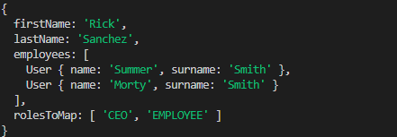
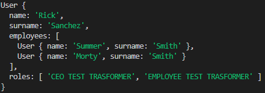

# Mapper-Factory
Mapper-Factory is a fully documented TypeScript library that provides a simple and easy-to-use way to map objects from one type to another. With just a few lines of code, you can convert complex, nested objects into the desired format.

## Installation
To install the package, you can use npm by running the following command:

<code>npm i mapper-factory</code>

Or using yarn

<code>yarn add mapper-factory</code>

## Usage
### Mapping simple objects

Your class must extends *MapperFactory*

```
class User extends MapperFactory {
    ...
}
```

After that, you can use *@MapField* decorator over single property to specify the mapping:

```
class User extends MapperFactory {

    @MapField({
        src: 'obj.obj[0][1]',
        transformer: (arr) => arr.map(role => role + " TEST TRASFORMER"),
        reverser: (arr) => arr.map(role => role.replace(" TEST TRASFORMER", "")),
    })
    roles?: string[];
}
```

Inside *@MapField* you can use:
- ***src*** define a string of original field name
- ***transform*** function to transform used in *constructor* of the class
- ***reverse*** function to reverse used in *toMap* method of the class

In this example:

```
class User extends MapperFactory {

    id: string;
    username: string;

    @MapField({
        src: 'firstName'
    })
    name: string;

    @MapField({
        src: 'lastName'
    })
    surname: string;

    @MapField({
        src: 'rolesToMap',
        transformer: (arr) => arr.map(role => role + " TEST TRASFORMER"),
        reverser: (arr) => arr.map(role => role.replace(" TEST TRASFORMER", "")),
    })
    roles?: string[];

    @MapField({
        transformer: (arr) => arr.map(user => new User(user))
    })
    employees?: User[];
}
```

We can define a new User ***u***:

```
let emp1: User = new User({ firstName: "Summer", lastName: "Smith" });
let emp2: User = new User({ firstName: "Morty", lastName: "Smith" });

let u = new User({ firstName: "Rick", lastName: "Sanchez", employees: [emp1, emp2], rolesToMap: ["CEO", "EMPLOYEE"] });
```

In that way you can create a new JS Object User passing a JSON object. Automatically constructor use *src* and *transformer* field to obtain the correct object you want.

In this specific case we have trasformed a JSON object:



In this JS Object:



Just using the constructor of *User* class.

If you want to return to the original JSON Object you can just call ***toMap()*** method, in that way:

```
u.toMap()
```

Obtaining the original JSON Object.

You can also fill properties of an object from another by using ***objToModel()*** method, in that way:

```
let uCopy = new User();
uCopy.objToModel(u);
```

This method is meant to be used also when you have a JSON object but in the correct format, for example:

```
let uCopy = new User();
uCopy.objToModel({ name: "Rick", surname: "Sanchez", employees: [emp1, emp2], roles: ["CEO", "EMPLOYEE"] })
```

Another utility method is ***empty()*** method, you can check if your object is empty or not in that way:

```
let user = new User();
user.empty(); //TRUE

user.name = "Rick";
user.empty(); //FALSE
```

It is implemented also a GET/SET method by path. Using ***get(path: string)*** and ***set(path: string, value: any)*** you can access to the property you want and GET or SET the value:

```
u.set("name", "Rick TEST-SET");
console.log(u.get("name"));
```

With this mapper you can easily obtain a performant ***deep copy*** of your object doing:

```
let userDeepCopy = new User(u.toMap());
```